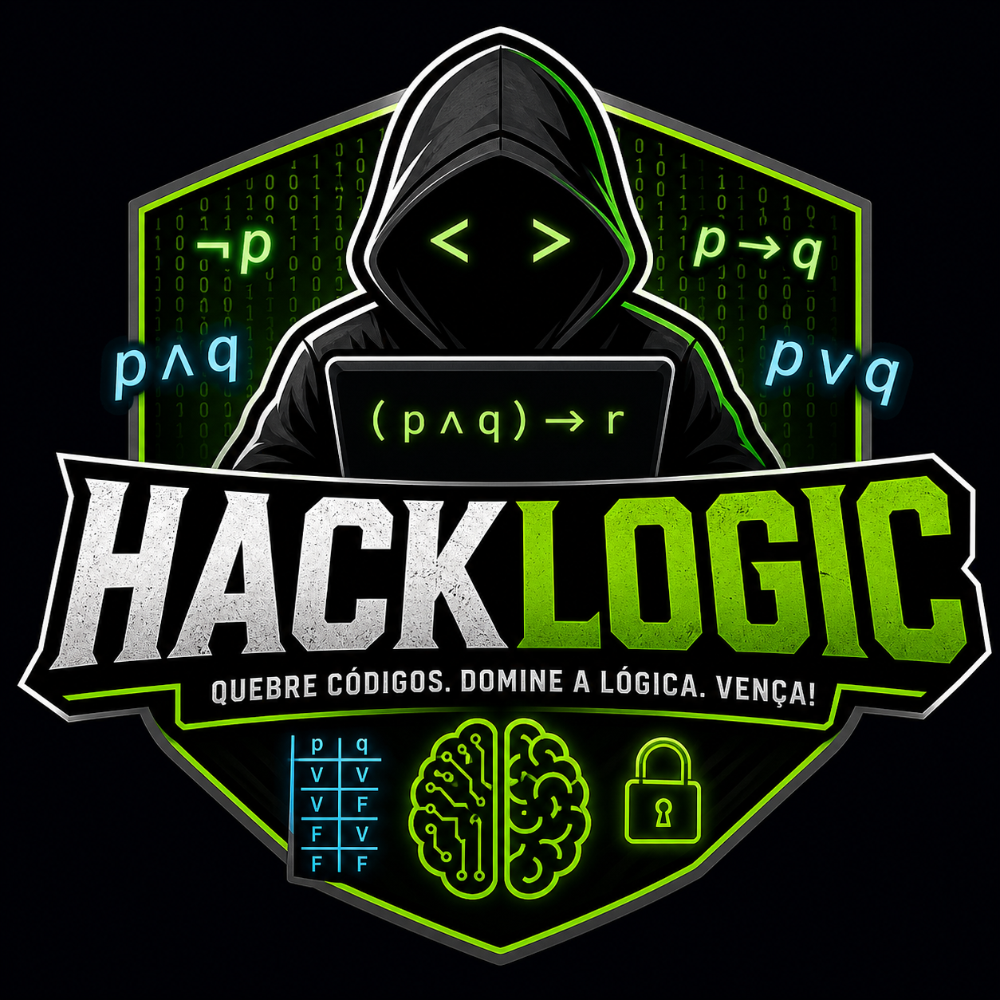

# HackLogic



Jogo educativo em Python sobre logica proposicional, com interface grafica em
CustomTkinter e tema inspirado em terminal hacker.

## Como rodar

Instale a dependencia da interface:

```bash
pip install customtkinter
```

Execute o jogo:

```bash
python main.py
```

## Conteudos abordados

- proposicoes
- negacao
- conjuncao
- disjuncao
- implicacao
- bicondicional
- equivalencia logica
- Leis de De Morgan
- Modus Tollens

## Grupo

- Marcelo Fonseca
- João Carlos Mafra
- Luiz Vieira Carvalho
- Vinícius Cezar
- Eduardo Esteves
- Marcio Rodriguez
